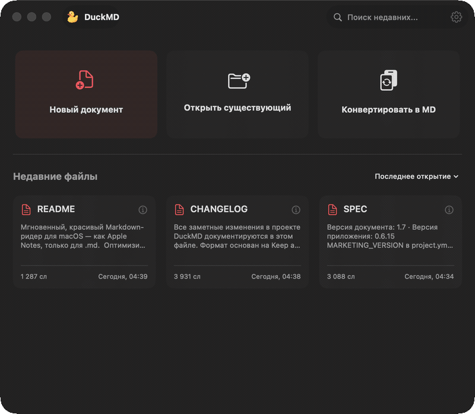
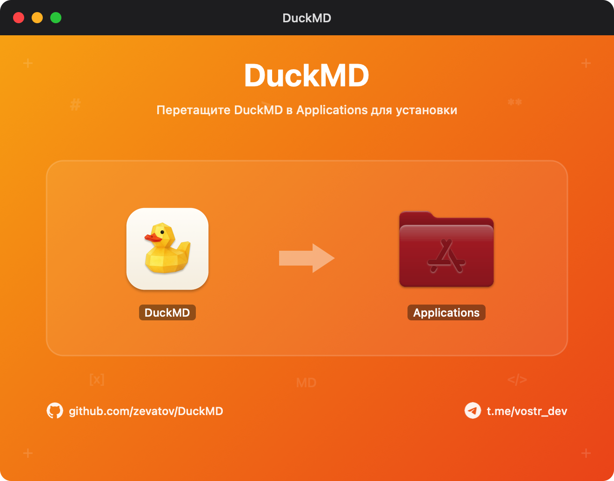

<div align="center">

# 🦆 DuckMD

**Мгновенный, нативный Markdown-ридер и редактор для macOS в эстетике Apple Notes**

[](https://apple.com/macos)
[](https://swift.org)
[](DuckMDTests/)
[](LICENSE)
[](https://github.com/zevatov/DuckMD/releases/tag/v0.6.18)

<br/>

<p align="center">
  
</p>

<br/>

[Скачать DuckMD 0.6.18](https://github.com/zevatov/DuckMD/releases/download/v0.6.18/DuckMD-0.6.18.dmg) • [ Возможности ](#-возможности-текущих-исходников) • [ Установка ](#-установка) • [ Документация ](#-документация) • [ Сборка ](#-сборка-из-исходников)

</div>

---

**DuckMD** — быстрый легковесный просмотрщик, редактор и конвертер Markdown для macOS. Создан как альтернатива неповоротливым электрон-редакторам: мгновенный старт (<1 секунды), нативная типографика Apple, интерактивный режим Split с живой синхронизацией скролла, встроенный конвертер (DOCX, PDF, RTF, HTML, TXT) и полная приватность — все файлы обрабатываются исключительно локально.

---

## 📸 Интерфейс и установка

<div align="center">
  
</div>

### 📦 Установка

1. Скачайте [DuckMD-0.6.18.dmg](https://github.com/zevatov/DuckMD/releases/download/v0.6.18/DuckMD-0.6.18.dmg).
2. Откройте образ и перетащите **DuckMD** в папку **Applications**.
3. Первый запуск — правый клик по приложению → **Открыть**, потому что notarization нет.

---

## 🚀 Возможности текущих исходников

- **Устранение ложных алертов автосохранения (P0)**: механизм `FileWatcherService` и `DocumentFileService` подавляет собственные эхо-события атомарной записи и надёжно перепривязывает inode без ложных предупреждений о «перемещении/удалении».
- **Чистый тёмный фон превью (P1)**: прозрачная подложка WKWebView исключает белые вспышки при переключении файлов и режимов отображения.
- **Молниеносный скролл и линейка строк (P1)**: внедрён кэш индексов строк `LineIndexCache` с $O(\log K)$ бинарным поиском вместо строкового сканирования; устранены циклические эхо в `SplitEditorView`.
- **Корректный рендеринг Markdown-таблиц (P2)**: контейнер таблиц поддерживает горизонтальный скролл без выпадения за границы документа; всплывающие кнопки удаления строк/колонок позиционируются идеально.
- **Эстетика Настроек ReTypeR**: новый нативный заголовок с фирменным градиентным бейджем, индикатор `UpdateChecker` (проверка релизов на GitHub), кнопки Telegram-канала и GitHub, карточки Apple-стиля.
- **Идеальные пропорции тулбара**: расширена таблетка заголовка в HubView, исключена обрезка символов в macOS Sequoia.
- **Интерактивный Хаб и Конвертер документов**: быстрый поиск, сортировка недавних документов и автоматическая конвертация файлов DOCX/PDF/RTF/HTML/TXT в `.md`.

---

## 📚 Документация

Полная спецификация проекта живёт в [`docs/`](./docs):

| Документ | О чём |
|---|---|
| **[docs/ARCHITECTURE.md](./docs/ARCHITECTURE.md)** | Архитектура, стек, оконная система, поток данных, зависимости и сборка |
| **[docs/UX.md](./docs/UX.md)** | Экраны: хаб, документ (3 режима), конвертер, настройки, About; макеты, флоу, хоткеи |
| **[docs/SPEC.md](./docs/SPEC.md)** | Что строим: концепция, требования, критерии приёмки |
| **[docs/DECISIONS.md](./docs/DECISIONS.md)** | Журнал архитектурных решений и ответов на уточняющие вопросы |
| **[CHANGELOG.md](./CHANGELOG.md)** | Статус реализации и история версий |

---

## 🗺️ Экосистема нативных утилит для macOS

DuckMD развивается как часть серии локальных, быстрых и бесплатных инструментов в нативном стиле Apple от [Stanislav Zevatov](https://github.com/zevatov):
- 🎙️ **[SingAR](https://github.com/zevatov/SingAR)** — нативный голосовой ввод, ассистент диктовки и vibe-кодинга для macOS (локальный Whisper + Metal).
- ⌨️ **[ReTypeR](https://github.com/zevatov/ReTypeR)** — мгновенная умная автоконвертация раскладки клавиатуры без сети и задержек.
- 🦆 **[DuckMD](https://github.com/zevatov/DuckMD)** — быстрый и чистый Markdown-ридер, редактор и конвертер документов.

---

## 🛠 Сборка из исходников

Проект использует [XcodeGen](https://github.com/yonaskolb/XcodeGen):

```bash
# 1. Генерация Xcode-проекта
xcodegen generate

# 2. Сборка Release DMG-образа с кастомным оформлением
./scripts/build_dmg.sh

# 3. Запуск полного набора unit-тестов
xcodebuild test -project DuckMD.xcodeproj -scheme DuckMD -destination 'platform=macOS'
```

---

## 📦 Установка и первый запуск

### Требования

- macOS 26 или новее, Apple Silicon или Intel.
- Для сборки: Xcode с toolchain macOS 26 и [XcodeGen](https://github.com/yonaskolb/XcodeGen) (`brew install xcodegen`).

### Готовый DMG

Канал уже есть: [DuckMD-0.6.18.dmg](https://github.com/zevatov/DuckMD/releases/download/v0.6.18/DuckMD-0.6.18.dmg). Локальная сборка ниже остаётся альтернативой.

### Сборка и запуск локально

```bash
# 1. Генерация Xcode-проекта (если ещё не выполнена)
xcodegen generate

# 2. Сборка .app + .dmg с локальной подписью (SIGN_MODE по умолчанию auto)
./scripts/build-test-dmg.sh
```

Скрипт [`scripts/build-test-dmg.sh`](scripts/build-test-dmg.sh) кладёт артефакты в `build/dist/` с версией в имени:

- `build/dist/DuckMD-<версия>.app`
- `build/dist/DuckMD-<версия>.dmg`

Запустите `.app` напрямую из `build/dist/` либо откройте DMG и перетащите приложение в **Applications**.

### Локальная подпись

В режиме по умолчанию (`SIGN_MODE=auto`) приложение подписывается сертификатом **Apple Development**, если он найден в связке ключей; иначе сборка автоматически откатывается к ad-hoc-подписи. Проверить подпись собранного приложения:

```bash
codesign --verify --strict --verbose=2 "build/dist/DuckMD-<версия>.app"
```

### «Приложение повреждено» / «не удаётся проверить разработчика»

Так Gatekeeper реагирует на карантинный атрибут `com.apple.quarantine`, который macOS ставит любым файлам, загруженным из сети, — сам файл приложения при этом не повреждён. У опубликованного DMG notarization нет, поэтому достаточно одного из двух действий:

- правый клик по `.app` → **«Открыть»** и подтвердить запуск в диалоге;
- либо снять атрибут командой:

```bash
xattr -dr com.apple.quarantine /Applications/DuckMD.app
```

Отключать Gatekeeper глобально (например, через `spctl --master-disable`) не следует.

---

© 2026 DuckMD · Лицензия [MIT](./LICENSE) · [Документация](./docs) · [История изменений](./CHANGELOG.md) · Исходники `0.6.18` ([MARKETING_VERSION](project.yml:11))
